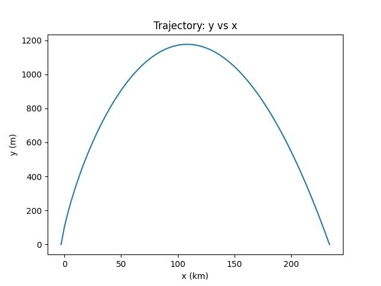
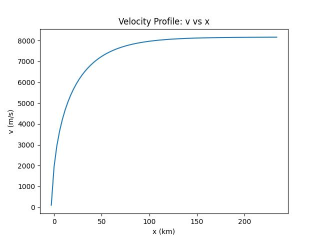

# TrajectoryFXM

This repository demonstrates the usage of both SplitFXM to solve self-propelled trajectory boundary value problems

## What does 'split' mean?
The user is directed to [SplitFXM](https://raw.githubusercontent.com/gpavanb1/SplitFXM/refs/heads/main/README.md) README for further details and documentation

## How to install and execute?

This repository uses [uv](https://github.com/astral-sh/uv).

* To install requirements, use `uv venv` and `uv pip install --resolve-uv-lock`
* To generate the seed, go to `seed` folder and run `uv run python generate_seed.py`
* To solve the BVP, run `uv run python main.py`

## Benchmark
The Split-Newton approach (with split at variable 1) was used to solve the BVP. The derivation for the problem can be found [here](derivation.md). The parameters chosen are as follows:

* Density of Air : 1.0 Kg/m^3
* Drag Coefficient (Cd) : 0.3
* Cross-Section Area: 1.0e-2 m^2
* Thrust : 1.0e5 N
* Mass : 100 Kg
* Gravitational Constant : 9.81 m/s^2
* Distance to target : ~230.9 Km (from seed)

The results are as follows:

## Whom to contact?

Please direct your queries to [gpavanb1](http://github.com/gpavanb1)
for any questions.

Do join the [SplitFXM Google Group](https://groups.google.com/g/splitfxm) for discussions and updates!